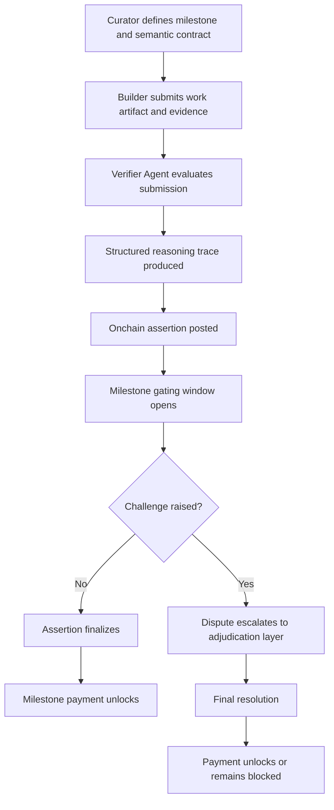

# Narrow Onchain POC
## A bounded first implementation for Hybrid Agentic-Optimistic Oracle (HAOO)

## 1. Purpose

This document narrows the broader HAOO proposal into a first implementation path that is intellectually serious, technically bounded, and economically testable.

The objective is not to prove that all forms of human work can be verified by an agentic oracle. That would be too broad, too ambiguous, and too easy to dismiss as speculative.

The objective is much narrower:

> Can a semantic verifier, combined with milestone gating and an optimistic challenge window, support capital release for a bounded class of software-verifiable tasks more reliably than price alone?

This is the smallest version of the proposal that still tests the real thesis.

If the answer is yes, the model can later expand into more complex categories of work. If the answer is no, that failure will also be informative, because it will reveal whether the bottleneck lies in semantic contract design, verifier quality, or dispute economics.

---

## 2. Why a narrow POC is the correct first step

The broad HAOO proposal makes a large claim: that long-tail coordination markets need a stronger verification primitive than pure price signals.

That claim should not be tested first in the hardest possible environment.

A sensible first implementation should have:

- relatively explicit success criteria
- evidence that can be structured and inspected
- disputes that are rare but meaningful
- milestone outcomes that can plausibly be reduced to binary or near-binary resolution
- enough ambiguity to make verification non-trivial, but not so much ambiguity that every case becomes governance by default

Software-verifiable milestones satisfy these constraints better than other categories of work.

They are not perfectly objective, but they are bounded enough to support:
- semantic contracts
- machine-assisted verification
- auditable evidence trails
- optimistic dispute windows

This makes them the right first environment for testing the primitive.

---

## 3. The core thesis being tested

The narrow POC is built to test four linked claims:

### Claim 1
A semantic contract can express milestone completion more richly than market price alone.

### Claim 2
A verifier agent can produce a useful first-pass judgment against that contract.

### Claim 3
Milestone gating can prevent agent outputs from becoming final without review.

### Claim 4
An optimistic challenge window can preserve decentralized accountability without forcing every resolution into slow governance.

The POC succeeds if these four claims hold together in practice for a bounded class of tasks.

---

## 4. What the POC is, and what it is not

### The POC is:
- a test of a **verification primitive**
- a milestone-gated release mechanism for structured tasks
- a hybrid architecture with offchain semantic verification and onchain economic finality
- a bounded experiment in resolver design

### The POC is not:
- a full general-purpose oracle for all work
- a fully permissionless verifier market from day one
- a final token-economic design
- a replacement for all human judgment
- proof that arbitrary real-world work can be reduced to binary machine verdicts

This distinction matters. The value of the POC comes from being narrow enough to be falsifiable.

---

## 5. Design principles

The narrow POC should be built around five principles.

### 5.1 Verifiable before scalable
The first version should optimize for correctness and legibility, not throughput.

### 5.2 Semantic before economic
The system should first decide whether the work appears complete according to the contract, before deciding whether capital should move.

### 5.3 Optimistic before adjudicated
The default path should assume honest verification, but preserve a path to challenge.

### 5.4 Gated before final
A positive verifier result should not release funds instantly. There must be an intermediate gating period.

### 5.5 Narrow before general
The first version should prove one bounded primitive, not overclaim a universal oracle.

---

## 6. Scope of the first milestone classes

The initial milestone types should be constrained to tasks where evidence is inspectable and the success criteria can be formalized with reasonable precision.

## Recommended first classes

### A. GitHub merge milestone
Example:
- PR merged into a specified branch
- required files modified
- tests green
- merge completed before deadline

### B. Testnet deployment milestone
Example:
- contract deployed to a specified testnet
- deployment address matches expected metadata
- verification artifact uploaded
- basic interaction check succeeds

### C. Signed artifact publication milestone
Example:
- a report, config, spec, or output file published
- signature matches expected identity
- hash matches submission claim
- required fields present

### D. Deterministic repo change milestone
Example:
- config or documentation update satisfying explicit structural requirements
- file diff conforms to a bounded rule set
- no forbidden files modified

These classes are useful because they preserve real ambiguity while remaining auditable.

---

## 7. Semantic contract schema

Each milestone should be instantiated as a semantic contract:

$$
C = (P, E, V)
$$

where:

- $$P$$ = problem statement and success criteria
- $$E$$ = evidence schema
- $$V$$ = verification logic manifest

## Suggested schema fields

### 7.1 Milestone metadata
- milestone ID
- market ID
- title
- description
- deadline
- curator identity

### 7.2 Success criteria
- explicit completion conditions
- required outputs
- allowed tolerances
- prohibited substitutions

### 7.3 Evidence schema
- repo URL
- PR number
- commit hash
- deployment transaction
- contract address
- signed artifact hash
- attestation source

### 7.4 Verification logic manifest
- required checks
- ordering of checks
- confidence thresholds
- ambiguity triggers
- fail-fast conditions
- escalation conditions

### 7.5 Challenge parameters
- liveness period
- bond size
- eligible challengers
- dispute forum
- final adjudicator path

The point of the semantic contract is not to eliminate judgment. It is to make judgment inspectable.

---

## 8. Actors in the system

The narrow POC should model four actors clearly.

### 8.1 Curator
Defines the milestone and semantic contract.

### 8.2 Builder
Submits the work artifact and evidence of completion.

### 8.3 Verifier Agent
Evaluates the submission against the semantic contract and emits a structured result.

### 8.4 Challenger
Reviews the verifier output during the gating window and disputes if necessary.

Optionally, a fifth role can exist:

### 8.5 Final adjudicator
A slower human or reputation-weighted resolution layer that only activates when disputes occur.

---

## 9. The proposed lifecycle

### Step 1: Curator defines the milestone

The curator writes the milestone in a way that is interpretable by both humans and machines.

This is where the system’s real quality begins. Weak milestones produce weak verification. Strong milestones produce high-quality machine assistance and low dispute frequency.

The milestone must define:
- what counts as completion
- what evidence is admissible
- what the verifier should check
- what conditions require human escalation

### Step 2: Builder submits evidence

The builder submits:
- the work artifact
- the evidence package
- proof of authorship or provenance
- optional explanatory context

This package should be sufficient for an informed third party to inspect the claim.

### Step 3: Verifier agent evaluates

The verifier agent performs:
- evidence collection
- evidence normalization
- rule checking
- semantic interpretation
- conflict detection
- ambiguity scoring

It returns one of the following:

- `SUCCESS`
- `FAILURE`
- `AMBIGUOUS` (optional in early prototypes)

Alongside that result, it emits a reasoning trace.

### Step 4: Reasoning trace generation

The reasoning trace is critical.

It should include:
- evidence references
- explicit checks passed or failed
- rule-to-evidence mapping
- unresolved ambiguities
- confidence assessment
- citations or linked artifacts

Without the trace, the verifier becomes opaque.
With the trace, it becomes inspectable.

### Step 5: Onchain assertion

The verifier result is posted onchain in minimal form.

The assertion contract should record:
- milestone ID
- claimed result
- hash of the reasoning trace
- timestamp
- challenge deadline
- challenger bond amount
- settlement state

The full trace can remain offchain if it is content-addressed and hash-linked to the assertion.

### Step 6: Milestone gating window

This is the crucial middle-gating stage.

Even if the agent says `SUCCESS`, the system should not release funds immediately.

Instead:
- the result becomes visible
- the trace becomes inspectable
- challengers can review and dispute
- the protocol waits through the liveness period

This stage is what prevents automation from becoming unaccountable.

### Step 7: Challenge or settlement

If no challenge is raised:
- the result finalizes
- milestone payment unlocks

If a challenge is raised:
- the claim enters a slower dispute path
- the dispute forum reviews the trace, evidence, and challenge
- final resolution overrides the provisional assertion if necessary

---

## 10. Diagram

---

## 11. Worked Example: Software Milestone Resolution

To make the narrow POC more concrete, this section walks through a single bounded example from end to end.

### Example milestone

A curator wants to fund a contributor to implement and ship a bounded software task.

#### Milestone
Merge PR #142 into the `main` branch of repository `oracle-demo`, with:
- all required files modified
- CI tests passing
- merge completed before deadline
- no forbidden files changed

#### Semantic contract summary
- **Problem statement**: Implement milestone-gated verification flow for a demo repository
- **Success criteria**:
  1. PR #142 is merged into `main`
  2. files `contracts/AssertionGate.sol` and `README.md` are modified
  3. CI status is green at merge time
  4. no changes appear in `tokenomics/`
  5. merge occurs before `2026-06-15T23:59:59Z`
- **Evidence schema**:
  - repository URL
  - PR URL
  - merge commit hash
  - CI run URL
  - timestamp
- **Verification logic manifest**:
  - confirm merge target branch
  - confirm required file set
  - confirm forbidden file set untouched
  - confirm CI pass
  - confirm deadline satisfaction

### Builder submission

The builder submits:
- repository: `https://github.com/example/oracle-demo`
- PR URL: `https://github.com/example/oracle-demo/pull/142`
- merge commit hash: `0xabc123demo`
- CI run URL: `https://github.com/example/oracle-demo/actions/runs/987654321`
- optional note: “Implemented the assertion gate, updated documentation, and validated the basic challenge window flow.”

### Verifier agent evaluation

The verifier agent performs the following checks:

1. fetches PR metadata
2. confirms PR #142 merged into `main`
3. checks modified file list
4. confirms `contracts/AssertionGate.sol` and `README.md` were changed
5. confirms no file in `tokenomics/` was changed
6. checks CI status at merge commit
7. compares merge timestamp with milestone deadline

### Verifier output

The verifier returns:

- **Result**: `SUCCESS`
- **Confidence**: high
- **Reasoning trace hash**: `0xtrace123demo`
- **Notes**: no ambiguity detected

### Reasoning summary

- PR #142 merged into `main`
- required files modified
- forbidden file set untouched
- CI status passed
- merge completed before deadline
- no conflicting evidence found

### Onchain assertion

The protocol posts a minimal assertion containing:
- milestone ID
- result = `SUCCESS`
- reasoning trace hash
- submission timestamp
- challenge deadline = `+24h`
- challenger bond requirement

### Milestone gating window

For the next 24 hours:
- the assertion is publicly visible
- the reasoning trace is inspectable
- any eligible challenger can dispute the result with a bond

### Settlement paths

#### Path A: No challenge
If no challenge is raised during the liveness window:
- the result finalizes
- milestone payment unlocks
- builder receives capital tranche

#### Path B: Challenge raised
Suppose a challenger claims the PR changed a forbidden config path that the verifier missed.

Then:
- the challenger posts a bond
- the dispute escalates
- the final adjudicator inspects the evidence and reasoning trace
- if the challenge is correct, the assertion is overturned
- if the challenge is wrong, the challenger loses the bond

### Why this example matters

This example shows the intended role of the hybrid oracle clearly:

- the verifier agent does the first-pass semantic work
- the protocol does not blindly trust the agent
- milestone gating creates a review window
- capital moves only after the assertion survives challenge

In other words, the system uses automation to accelerate verification, but not to eliminate accountability.

---

## 12. Why milestone gating matters

Milestone gating is not just a procedural detail. It is the conceptual center of the POC.

Without gating, the verifier agent becomes an unreviewable authority.

With gating:
- the agent becomes a high-speed proposer, not an absolute judge
- the protocol gets speed on the default path
- challengers preserve accountability on the exceptional path
- capital moves only after both semantic verification and liveness review

This mirrors the deeper intuition of optimistic systems:
verification does not need to be maximally expensive every time, it only needs to be challengeable when something is wrong.

---

## 13. Onchain and offchain boundaries

A strong version of this POC should be explicit about what belongs onchain and what should remain offchain.

## Onchain
- assertion state
- timestamps
- challenge deadlines
- bond posting
- settlement logic
- payout gating

## Offchain
- evidence gathering
- semantic evaluation
- reasoning trace generation
- source normalization
- confidence and ambiguity analysis

This split is deliberate.

Trying to push semantic verification fully onchain too early would:
- raise costs
- reduce flexibility
- make iteration slower
- force premature technical commitments

The narrow POC should keep intelligence offchain and accountability onchain.

---

## 14. Why this is a meaningful test of reflexivity

The broader repo argues that long-tail coordination markets suffer from a reflexivity problem: price can fail to track genuine delivery, especially when liquidity is weak.

The narrow POC tests a direct response to that argument.

Instead of asking:
“Did the market price move enough to imply completion?”

the system asks:
“Did the builder satisfy the semantic contract, and did that result survive a challenge window?”

This is a different root of truth.

If it works, the protocol can begin to ground payout in evidence-backed milestone verification rather than in noisy, delayed, or strategically distorted price movement.

---

## 15. Relationship to prior art

This POC is not being designed in a vacuum.

### UMA’s Optimistic Truth Bot
UMA’s OTB is the strongest current precedent for the verifier side of the architecture. It uses a modular agentic pipeline, including routing, specialized solving, and overseer review, to generate structured oracle recommendations that can later feed into an optimistic dispute framework.

Relevance:
- validates the “agent proposes, optimistic system challenges” pattern
- shows that reasoning traces and internal skepticism can improve oracle outputs
- demonstrates a live path toward hybrid semantic plus optimistic verification

### Polymarket + UMA
Polymarket’s use of UMA validates the economic side of the architecture:
- quick propose path
- challenge window
- dispute escalation only when needed

Relevance:
- proves optimistic dispute logic works under real economic pressure
- shows why final adjudication should be exceptional, not default

### Hybrid oracle research
Recent scholarship argues that AI should be used as an inference and filtering layer within a broader trust architecture, not as a substitute for trust assumptions.

Relevance:
- supports the core HAOO intuition
- strengthens the claim that a hybrid verifier is a rational next design step rather than a speculative novelty

---

## 16. Failure modes the POC should explicitly test

A strong POC is not only defined by success cases. It should also try to surface the main failure modes early.

### 16.1 Under-specified milestone
If the semantic contract is vague, the verifier becomes subjective.

**Test:** Can two independent readers predict what the verifier should conclude?

### 16.2 False positive verification
The agent marks low-quality or incomplete work as complete.

**Test:** Can challengers reliably detect and dispute weak positive assertions?

### 16.3 False negative verification
The agent rejects valid work due to brittle rule interpretation.

**Test:** Can the dispute layer correct over-rigid semantic checks?

### 16.4 Ambiguity collapse
The system forces binary resolution where uncertainty should remain explicit.

**Test:** Should the prototype allow `AMBIGUOUS` as an output state?

### 16.5 Challenge spam
Bad-faith challengers slow settlement without strong evidence.

**Test:** What bond size or eligibility rules are needed to deter spam?

### 16.6 Opaque reasoning
The verifier result cannot be meaningfully inspected.

**Test:** Can a challenger understand the trace well enough to dispute intelligently?

---

## 17. Proposed evaluation criteria

The first POC should not be judged by “does this solve the oracle problem.”

It should be judged by narrower criteria.

### Functional criteria
- Can milestones be encoded clearly?
- Can evidence be ingested and normalized?
- Can the verifier emit a coherent trace?
- Can assertions be posted and challenged correctly?

### Economic criteria
- Are challenges rare but meaningful?
- Is the challenge path usable without dominating the system?
- Does gating create reasonable settlement latency?

### Governance criteria
- Can disputes be resolved without relying on fully centralized intervention?
- Are failure cases legible enough to refine the contract design?

### Product criteria
- Do builders understand what they need to submit?
- Do challengers understand what they are inspecting?
- Does the process feel fairer than price-led verification?

---

## 18. Why this narrow POC is intellectually honest

A common failure in crypto design is jumping from mechanism essay to universal protocol claims.

This POC avoids that.

It does not say:
- all work can be machine-verified
- AI can replace judgment
- market price no longer matters
- we have solved oracle truth

It says something more disciplined:

> In a narrow class of milestone-gated, software-verifiable tasks, a semantic verifier plus optimistic challenge layer may outperform price alone as the first-pass verification primitive.

That is a testable claim.
That is why this is a good POC.

---

## 19. Suggested implementation phases

### Phase 1: Contract discipline
- define 3 to 5 milestone templates
- formalize semantic contract fields
- define admissible evidence types

### Phase 2: Offchain verifier
- build evidence collection pipeline
- implement rule checking
- produce structured trace output

### Phase 3: Onchain assertion layer
- deploy minimal assertion contract
- support hash-linked reasoning traces
- enforce liveness window and bond logic

### Phase 4: Challenge simulation
- run adversarial test cases
- inject false positives and false negatives
- test dispute correction path

### Phase 5: Controlled pilot
- run on synthetic or low-stakes milestone markets
- collect challenge frequency, false positive rate, settlement latency, and curator feedback

---

## 20. Open questions

This POC should help answer, not hide, the following questions:

- How expressive must semantic contracts be before they become too expensive to curate?
- When is `AMBIGUOUS` the correct system output?
- Should challenge rights be open to anyone, or limited by reputation?
- Which milestone classes produce the best signal-to-ambiguity ratio?
- How much of the verifier trace should be standardized?
- What dispute rate is healthy for an optimistic coordination system?

---

## 21. References

1. UMA, *AI Is Helping Us Find the Truth. Here's How.*  
   https://blog.uma.xyz/articles/ai-is-helping-us-find-the-truth

2. UMA, *Can AI Agents Enhance the Optimistic Oracle?*  
   https://blog.uma.xyz/articles/experiment-can-ai-agents-enhance-uma-oracle

3. UMA, *Inside UMA's Optimistic Truth Bot*  
   https://blog.uma.xyz/articles/inside-umas-optimistic-truth-bot

4. Giulio Caldarelli, *Can Artificial Intelligence Solve the Blockchain Oracle Problem? Unpacking the Challenges and Possibilities*  
   https://doi.org/10.3389/fbloc.2025.1682623

5. Oriole Insights, *What is UMA? Optimistic Oracle for Prediction Markets*  
   https://app.orioleinsights.io/article/what-is-uma-optimistic-oracle-prediction-markets

6. See the main repository README for the broader HAOO framing and threat model.
